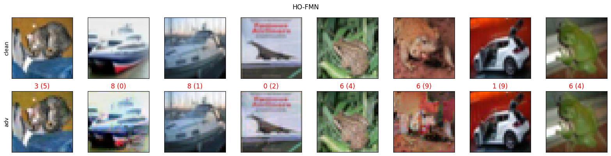

# HO-FMN: Hyperparameter Optimization for Fast Minimum-Norm Attacks

This study proposes using hyperparameter optimization to improve fast minimum-norm attacks on machine-learning models

:video_game: For a quick demo example, check out [this notebook](src/ho_fmn_demo.ipynb).

## How to tune FMN

```python
from ho_fmn import tune_fmn
from src.models.load_data import load_data

# load the model and the dataset (default: CIFAR10)
model, dataset = load_data(model_id=8)

data_loader = ...  # pytorch dataloader

batch_size = 10
optimizer = 'SGD'
scheduler = 'CosineAnnealingLR'
steps = 10  # steps of the attack
num_samples = 1  # numer of trials for searching
loss = 'LL'  # default: logit loss

fmn_best_config = tune_fmn(model=model,
                           data_loader=data_loader,
                           optimizer=optimizer,
                           scheduler=scheduler,
                           batch=batch_size,
                           steps=steps,
                           num_samples=num_samples,
                           loss=loss)
```


## Run FMN with best configuration

```python
from src.attacks.fmn_opt import FMNOpt

inputs, labels = next(iter(data_loader))

fmn_attack = FMNOpt(model=model,
                    inputs=inputs,
                    labels=labels,
                    norm='inf',
                    steps=steps,
                    optimizer=optimizer,
                    scheduler=scheduler,
                    optimizer_config=fmn_best_config['opt_s'],
                    scheduler_config=fmn_best_config['sch_s'],
                    logit_loss = True if loss == 'LL' else False)

_, best_adv = fmn_attack.run(log=True)
```

# Preview of the results

These are results against a CIFAR10 ResNet18:

<p align="center">

<p>