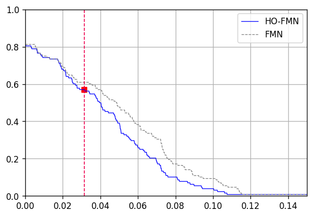
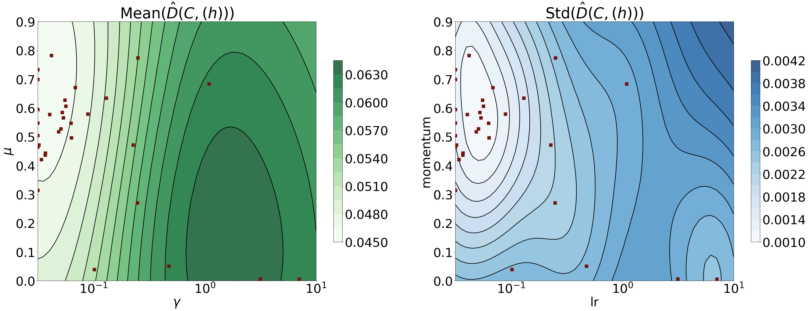

# HO-FMN: Hyperparameter Optimization for Fast Minimum-Norm Attacks

In this work we present the HO-FMN method for optimizing the hyperparameters of the Fast Minimum-Norm (FMN)
 attack [FMN](https://github.com/pralab/Fast-Minimum-Norm-FMN-Attack). The FMN version used here is implemented in PyTorch,
and is modular, meaning that one can select the loss, the optimizer and the scheduler for the optimization.

:video_game: For a quick demo example, check out [this notebook](src/ho_fmn_demo.ipynb).

## How to setup HO-FMN

```python
import torch
from torch.utils.data import DataLoader
from src.ho_fmn.ho_fmn import HOFMN
from src.attacks.fmn import FMN
from src.utils.model_data import load_data
device = torch.device('cuda') if torch.cuda.is_available() else torch.device('cpu')

loss = 'DLR'          # losses: LL, DLR, CE
optimizer = 'SGD'     # optimimzers: SGD, Adam, Adamax
scheduler = 'RLROP'   # schedulers: CALR, RLROP

steps = 100           # The number of FMN attack iterations
trials = 32           # Number of HO optimization trials
tuning_bs = 64        # Batch size for the tuning

model_id = 8
# load the model and the dataset (default: CIFAR10)
model, dataset, _, _ = load_data(model_id=model_id)
dataloader = DataLoader(dataset, batch_size=tuning_bs, shuffle=False)

ho_fmn = HOFMN(
    model=model,
    dataloader=dataloader,
    loss=loss,
    optimizer=optimizer,
    scheduler=scheduler,
    steps=steps,
    trials=trials,
    verbose=True,
    device=device
)

# Start the tuning process
best_parameters = ho_fmn.tune()
print(f"Best parameters:\n{best_parameters}")
```

## Run FMN with the best configuration

```python
from src.attacks.fmn import FMN

# Compute the samples used for the tuning
tuning_trials = trials
tuning_samples = tuning_bs*tuning_trials

attack_bs = 128         # Attack batch size
attack_steps = 200      # Attack steps

# Reload the model and the dataset
model, dataset, _, _ = load_data(model_id=model_id)

subset_indices = list(range(tuning_samples, tuning_samples + attack_bs))
dataset_frac = torch.utils.data.Subset(dataset, subset_indices)

dataloader = DataLoader(
    dataset=dataset_frac,
    batch_size=attack_bs,
    shuffle=False
)

# Extract the optimizer and scheduler config from the best params dictionary
optimizer_config, scheduler_config = ho_fmn.parametrization_to_configs(best_parameters,
                                                                       batch_size=attack_bs,
                                                                       steps=attack_steps)

model.eval()
model.to(device)

baseline_attack = FMN(
        model=model,
        steps=attack_steps,
        loss='LL',
        optimizer='SGD',
        scheduler='CALR',
        device=device
        )

tuned_attack = FMN(
        model=model,
        steps=attack_steps,
        loss=loss,
        optimizer=optimizer,
        scheduler=scheduler,
        optimizer_config=optimizer_config,
        scheduler_config=scheduler_config,
        device=device
        )

# Testing on a single batch
images, labels = next(iter(dataloader))

# Run the baseline attack for comparing the adversarial robustness
baseline_best_adv = baseline_attack.forward(images=images, labels=labels)
tuned_best_adv = tuned_attack.forward(images=images, labels=labels)
```

# Computing the robustness-perturbation curve (baseline vs tuned FMN)
```python
from src.utils.plots import compare_adv_robustness

compare_adv_robustness(baseline_best_adv, tuned_best_adv, images)
```

An example of baseline vs tuned FMN robustness-perturbation curves is shown here:
<p align="center">

<p>

# Tuning process insights
It is possible to plot the objective metric (median distance, the predicted value) seeing hos it changes varying two hyperparameters (e.g., learning rate and momentum):
```python
from utils.plots import plot_contour

# Extract the predictive model
tuning_model = ho_fmn.get_tuning_model()

# Change param_x, param_y accordingly
plot_contour(model=tuning_model, param_x='lr', param_y='momentum', metric_name="distance")
```

An example of a contour plot from the demo notebook is shown here:
<p align="center">

<p>

## Acknowledgements
HO-FMN has been developed with the support of project [SERICS (PE00000014)](https://serics.eu/);  project [FAIR (PE0000013)](https://fondazione-fair.it/) under the NRRP MUR program funded by the EU - NGEU; the European Union’s Horizon Europe Research
and Innovation Programme under the project [Sec4AI4Sec - Cybersecurity for AI-Augmented Systems](https://www.sec4ai4sec-project.eu/), grant agreement No 101120393, and [Fondazione di Sardegna under the project
‘‘TrustML: Towards Machine Learning that Humans Can Trust’’](https://www.fondazionedisardegna.it/), CUP:
F73C22001320007.

 &nbsp;&nbsp;  &nbsp;  &nbsp;&nbsp;  &nbsp;&nbsp; 
